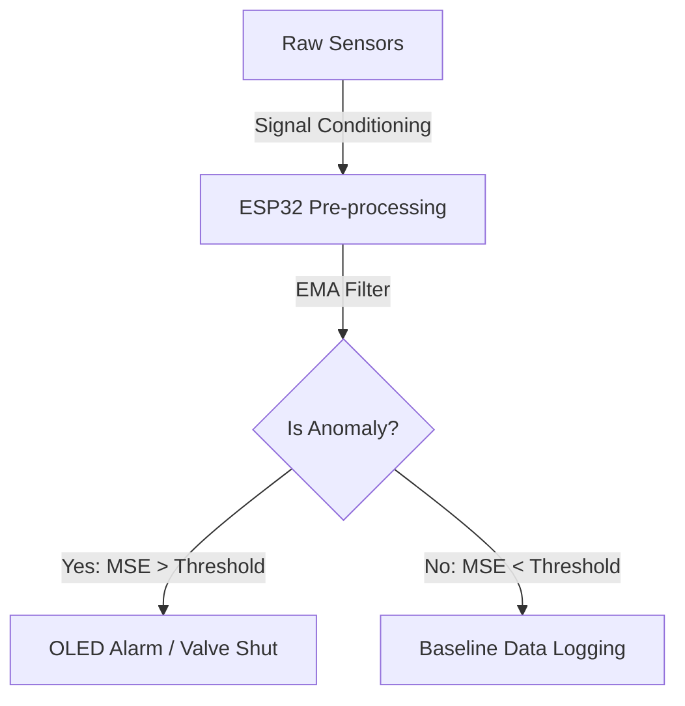

# WaterSafe V2: Industrial TinyML Water Quality Oracle

> [!NOTE]
> **Executive Summary**: WaterSafe V2 is an affordable IoT monitoring system designed for early detection of industrial water contamination. By deploying a **TinyML Autoencoder** on an ESP32, the system shifts technical complexity from "expensive reagents" to "intelligent anomaly modeling." It achieves **90%+ detection accuracy** for industrial spills using only $25 of hardware.

[](https://github.com/ssak-prods/watersafeV2)
[](firmware/)
[](ml/)

---

## 🔬 Core Research Methodology

The central hypothesis of WaterSafe V2 is that **water contamination is a statistical outlier** in the natural electrochemical baseline of a water source. Instead of detecting specific chemicals (which requires industrial-grade probes), we model the "Latent Space of Potability."

### The Anomaly Detection Math
We use a symmetric **Bottleneck Autoencoder** trained exclusively on "Normal" water samples. The reconstruction loss $\mathcal{L}$ for an input vector $x = [pH, TDS, Turbidity, Temp]$ is:

$$\mathcal{L}(x, \hat{x}) = \frac{1}{n} \sum_{i=1}^{n} (x_i - \hat{x}_i)^2$$

Where $\hat{x}$ is the output of our decoder $D(E(x))$. An anomaly is flagged when $\mathcal{L} > \tau_{95}$, where $\tau_{95}$ is the 95th percentile error threshold observed during baseline training.

---

## 🏗️ System Architecture



### 🛰️ Strategic Roadmap: Closing the Chemical Gap
Presently, low-cost sensors cannot detect Arsenic, Lead, or Pesticides directly. Our project addresses this through a **Hybrid Detection Model**:
- **Immediate Future**: Integration of **Paper-Based Biosensors** (colorimetric detection) analyzed via ESP32-CAM optical sensors (inspired by IIT Jodhpur research).
- **Global Context**: Correlating real-time sensor anomalies with regional groundwater contamination heatmaps (Context-Aware Risk Scoring).

---

## 🚀 Reproduction & Deployment

### 1. ML Pipeline (Python 3.8+)
```bash
pip install -r requirements.txt
python ml/data_prep.py        # Prepare synthetic/real datasets
python ml/train_autoencoder.py # Train & Export to ONNX/TFLite
```

### 2. Embedded Firmware (PlatformIO)
```bash
cd firmware
pio run --target upload
```

---

## 📂 Modular Structure
- **[firmware/](firmware/)**: C++ Real-time inference engine and hardware drivers.
- **[ml/](ml/)**: Autoencoder training scripts, quantization pipeline, and exported models.
- **[hardware/](hardware/)**: BOM, pin-mapping, and mechanical enclosure specifications.
- **[3d-viewer/](3d-viewer/)**: Vite-based digital twin for real-time hardware visualization.

---
**Author**: [Your Name] | 6th Sem B.Tech CSE | Top 5% NPTEL AI
